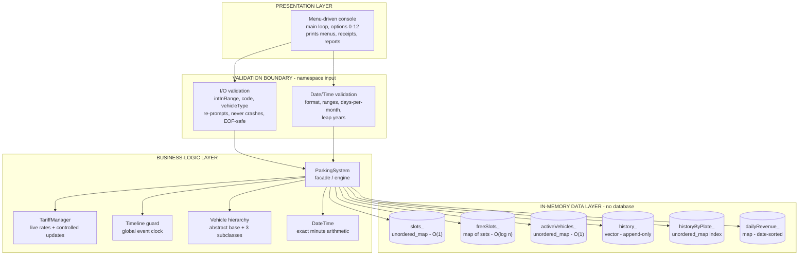
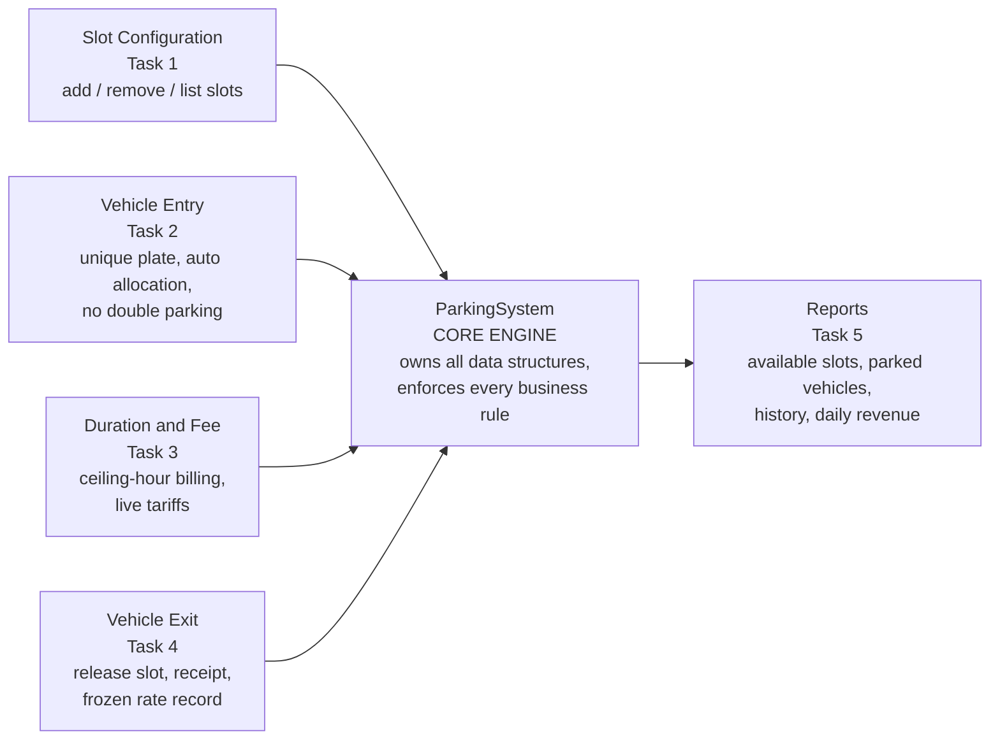
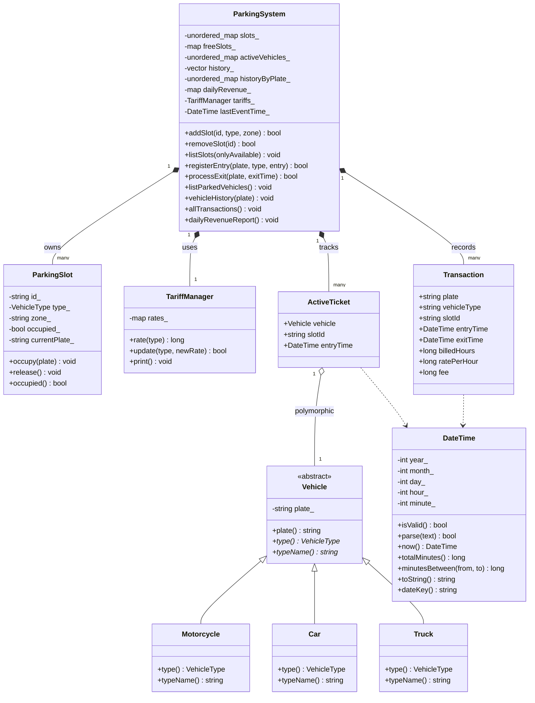
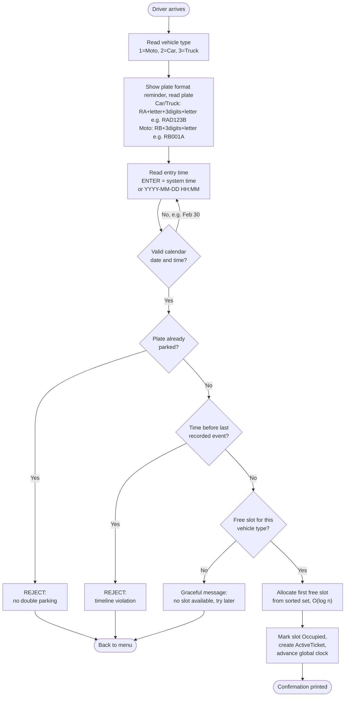
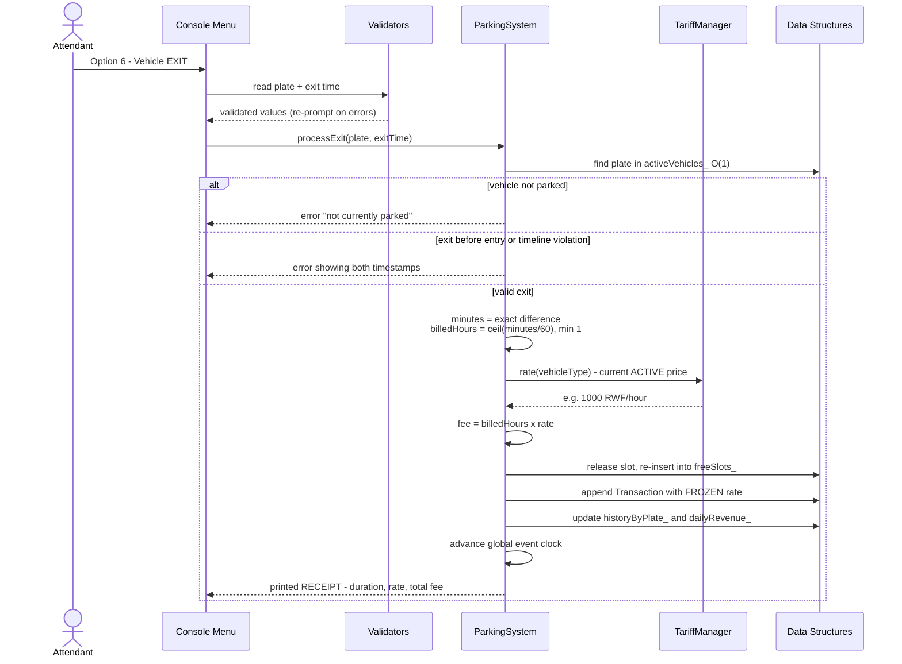
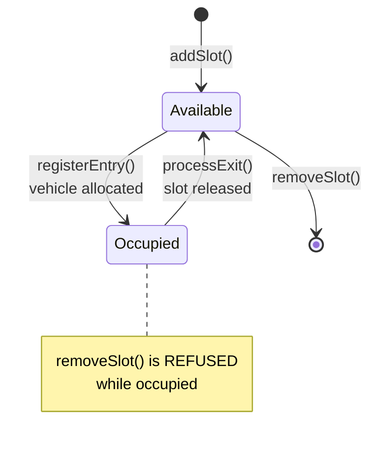
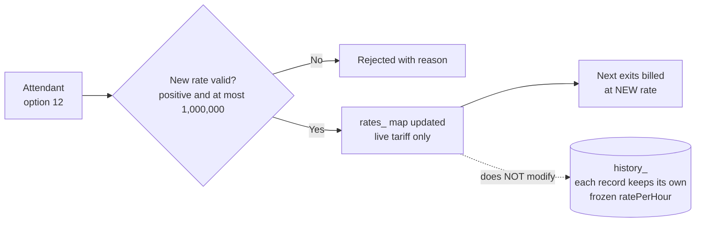

# System Architecture — Kigali Smart Parking Management System

All diagrams are written in **Mermaid**. Paste any block into
[mermaid.live](https://mermaid.live), GitHub, VS Code Markdown preview, or
draw.io (Arrange → Insert → Advanced → Mermaid) to render the drawing.

---

## 1. Layered system architecture

The system uses a **3-layer architecture**: a presentation layer (console
menu), a business-logic layer (the parking engine and its domain classes),
and an in-memory data layer (the chosen data structures). All user input
crosses a validation boundary before it can reach the engine.

---

## 2. Core system components

| # | Component | Type | Responsibility |
|---|-----------|------|----------------|
| 1 | **Menu interface** (`main`, `printMenu`) | Presentation | Menu-driven console UI; routes the 13 options to the engine; displays results, receipts and reports. |
| 2 | **Input validators** (`namespace input`) | Validation | The only gateway for user input. Line-based reading; rejects empty/non-numeric/out-of-range/malformed values with a clear message and re-prompt; EOF-safe. |
| 3 | **`DateTime`** | Domain | Strict `YYYY-MM-DD HH:MM` parsing; calendar validation (ranges, days-per-month, leap years); exact minute arithmetic across days/months/years (civil day-count algorithm). |
| 4 | **`Vehicle` hierarchy** | Domain (OOP) | Abstract base `Vehicle`; `Motorcycle`, `Car`, `Truck` subclasses created through a factory and used polymorphically. |
| 5 | **`ParkingSlot`** | Domain | Encapsulates slot ID, supported vehicle type, zone, status, and the plate currently occupying it. |
| 6 | **`TariffManager`** | Domain | Holds the live hourly rates (defaults: Moto 500 / Car 1,000 / Truck 2,000 RWF); controlled, validated runtime updates; never touches completed records. |
| 7 | **`ParkingSystem`** | Engine (facade) | Single entry point for every operation. Owns all data structures, enforces business rules and the **global timeline clock** (no event may precede the last recorded event; no exit before entry). |
| 8 | **Transaction store** | Data | `Transaction` records freeze the rate at exit time, are appended to `history_`, indexed per plate, and aggregated into `dailyRevenue_`. |

---

## 3. UML class diagram (OOP design)

Abstraction, inheritance, polymorphism and encapsulation exactly as
implemented in `main.cpp`:

---

## 4. Vehicle ENTRY flow (Task 2)

---

## 5. Vehicle EXIT and fee calculation (Tasks 3 and 4)

---

## 6. Parking slot life cycle

---

## 7. Price update rule (Task 3)

---

## 8. Component-to-data-structure mapping (DSA justification)

| Operation | Data structure | Category | Complexity |
|---|---|---|---|
| Slot lookup by unique ID | `unordered_map<string, ParkingSlot>` | linear (hash table) | O(1) avg |
| Allocate / release free slot per type | `map<VehicleType, set<string>>` | non-linear (red-black trees) | O(log n) |
| "Is this plate already parked?" | `unordered_map<string, ActiveTicket>` | linear (hash table) | O(1) avg |
| Completed transaction log | `vector<Transaction>` | linear (dynamic array) | O(1) append, O(n) traversal |
| History of one plate | `unordered_map<string, vector<size_t>>` | hash table + index list | O(1) avg |
| Daily revenue report, date-sorted | `map<string, long long>` | non-linear (red-black tree) | O(log n) insert, in-order traversal |
| Live tariffs | `map<VehicleType, long long>` | non-linear | O(log n) |

## Why this architecture

- **Separation of concerns**: the UI never touches data structures directly,
  and the engine never reads from `cin` — every operation is a method that
  returns success/failure plus a message, which also makes it unit-testable.
- **Single facade** (`ParkingSystem`) keeps all invariants in one place:
  a slot can never be in `freeSlots_` while occupied, and the timeline clock
  advances only after an operation fully succeeds.
- **Scalability**: hash maps give O(1) lookups on the hot paths (entry/exit
  by plate, slot by ID); ordered structures are used only where sorted order
  is actually needed (slot allocation, daily report).
